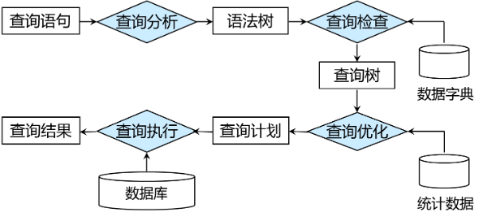
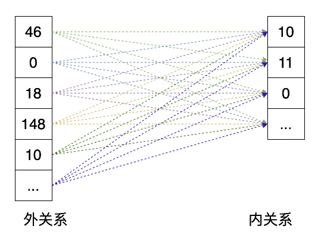
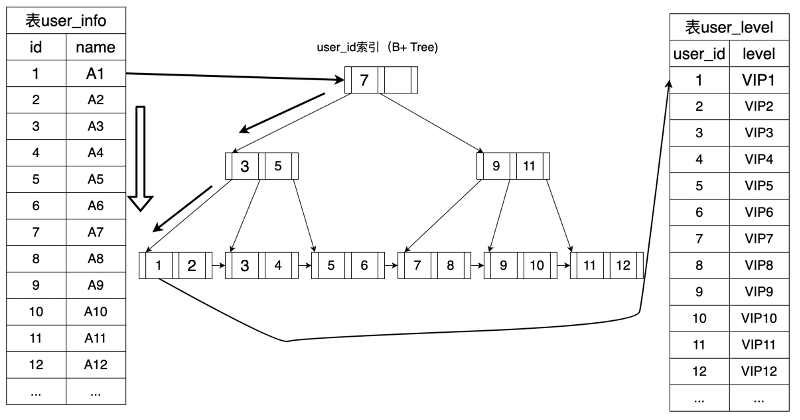
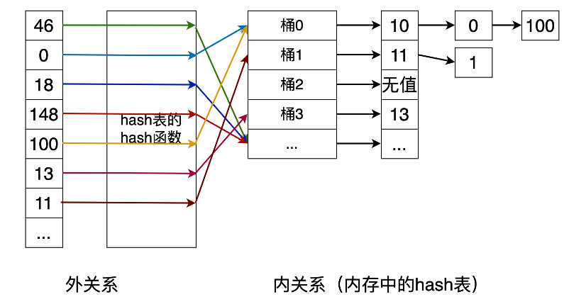
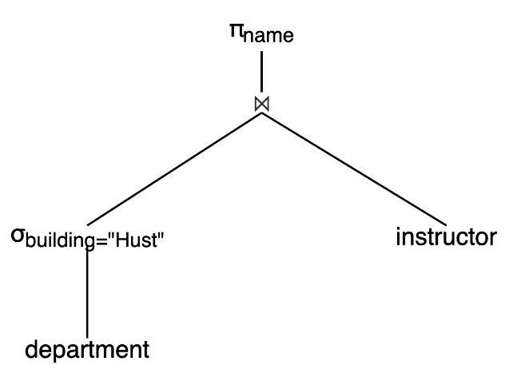

[上一章](lecture-3)        [Home](index)        [下一章](lecture-5)

# 第4章 查询处理

## 4.1查询处理概述



<center>图 4-1 关系数据库查询处理流程</center>

关系数据库管理系统查询处理可以分为4个阶段：查询分析、查询检查、查询优化和查询执行。

1. **查询分析** ：对用户提交的查询语句进行扫描、词法分析和语法分析，判断是否符合SQL语法规则，若没有语法错误，就会生成一棵语法树。
2. **查询检查** ：对语法树进行查询检查，首先根据数据字典中的模式信息检查语句中的数据对象，如关系名、属性名是否存在和有效；还要根据数据字典中的用户权限和完整性约束信息对用户的存取权限进行检查。若通过检查，则将数据库对象的外部名称转换成内部表示。这个过程实际上是对语法树进行语义解析的过程，最后语法树被解析为一个具有特定语义的关系代数表达式，其表示形式仍然是一棵树，称为查询树。
3. **查询优化** ：每个查询都会有多种可供选择的执行策略和操作算法，查询优化就是选择一个能高效执行的查询处理策略。一般将查询优化分为代数优化和物理优化。代数优化指对关系代数表达式进行等价变换，改变代数表达式中操作的次序和组合，使查询执行更高效；物理优化则是指存取路径和底层操作算法的选择，选择依据可以是基于规则、代价、语义的。查询优化之后，形成查询计划。
4. **查询执行** ：查询计划由一系列操作符构成，每一个操作符实现计划中的一步。查询执行阶段，系统将按照查询计划逐步执行相应的操作序列，得到最终的查询结果。

## 4.2 选择运算

选择操作的典型实现方法有全表扫描法和索引扫描法。

### 4.2.1 全表扫描法

对查询的基本表顺序扫描，逐一检查每个元组是否满足选择条件，把满足条件的元组作为结果输出。

假设可以使用的内存为M块，全表扫描的算法思想如下：

1. 按物理次序读表T的M块到内存；
2. 检查内存的每个元组t，如果t满足选择条件，则输出t；
3. 如果表T还有其他块未被处理，重复(1)和(2)。

这种方法适合小表，对规模大的表要进行顺序扫描，当选择率（即满足条件的元组数占全表比例）较低时，此算法效率很低。

### 4.2.2 索引扫描法

当选择条件中的属性上有索引（例如B+树索引或Hash索引）时，通过索引先找到满足条件的元组指针，再通过元组指针直接在要查询的表中找到元组。

**［例1 ］** 等值查询：`select * from t1 where col＝常量`，并且col上有索引（B+树索引或Hash索引均可） ，则使用索引得到col为该常量元组的指针，通过元组指针在表t1中检索到结果。

**［例2 ］** 范围查询： `select * from t1 where col > 常量`，并且col上有B+树索引，使用B+树索引找到col＝常量的索引项，以此为入口点在B+树的顺序集上得到col \&gt; 常量的所有元组指针， 通过这些元组指针到t1表中检索满足条件的元组。

**［例 3 ］** 合取条件查询：`select * from t1 where col1＝常量a AND col2 >常量b`，如果 col1和 col1上有组合索引（col1,col2），则利用此组合索引进行查询筛选；否则，如果 col1和 col2上分别有索引，则：

方法一：分别利用各自索引查找到满足部分条件的一组元组指针，求这2组指针的交集，再到t1表中检索得到结果。

方法二：只利用索引查找到满足该部分条件的一组元组指针，通过这些元组指针到t1表中检索，对得到的元组检查另一些选择条件是否满足，把满足条件的元组作为结果输出。

一般情况下，当选择率较低时，基于索引的选择算法要优于全表扫描。但在某些情况下，如选择率较高、或者要查找的元组均匀分散在表中，这时索引扫描法的性能可能还不如全表扫描法，因为还需要考虑扫描索引带来的额外开销。

## 4.3 排序运算

排序是数据库中的一个基本功能，用户通过Order by子句即能达到将指定的结果集排序的目的，而且不仅仅是Order by子句，Group by、Distinct等子句都会隐含使用排序操作。

### 4.3.1 利用索引避免排序

为了优化查询语句的排序性能，最好的情况是避免排序，合理利用索引是一个不错的方法。因为一些索引本身也是有序的，如B+树，如果在需要排序的字段上面建立了合适的索引，那么就可以跳过排序过程，提高查询速度。

例如：假设t1表存在B+树索引key1(key\_part1, key\_part2)，则以下查询可以利用索引来避免排序：

```sql

​	SELECT * FROM t1 ORDER BY key_part1, key_part2;
​	SELECT * FROM t1 WHERE key_part1 = constant ORDER BY key_part2;
​	SELECT * FROM t1 WHERE key_part1 > constant ORDER BY key_part1;
​	SELECT * FROM t1 WHERE key_part1 = constant1 AND key_part2 > constant2 ORDER BY 	key_part2;
```

如果排序字段不在索引中，或者分别存在于多个索引中，或者排序键的字段顺序与组合索引中的字段顺序不一致，则无法利用索引来避免排序。

### 4.3.2 数据库内部排序方法

对于不能利用索引来避免排序的查询，DBMS必须自己实现排序功能以满足用户需求。实现排序的算法可以是文件排序，也可以是内存排序，具体要由排序缓冲区（sort buffer）的大小和结果集的大小来确定。

数据库内部排序的实现主要涉及3种经典排序算法：快速排序、归并排序和堆排序。对于不能全部放在内存中的关系，需要引入外排序，最常用的就是外部归并排序。外部归并排序分为两个阶段：Phase1 – Sorting，对主存中的数据块进行排序，然后将排序后的数据块写回磁盘；Phase2 – Merging，将已排序的子文件合并成一个较大的文件。

#### 4.3.2.1 常规排序法

一般情况下通用的常规排序方法如下：

(1) 从表t中获取满足WHERE条件的记录；

(2) 对于每条记录，将记录的主键+排序键(id,colp)取出放入sort buffer；

(3) 如果sort buffer可以存放所有满足条件的(id,colp)对，则进行排序；否则sort buffer满后，进行排序并固化到临时文件中。（排序算法采用快速排序）；

(4) 若排序中产生了临时文件，需要利用归并排序算法，保证临时文件中记录是有序的；

(5) 循环执行上述过程，直到所有满足条件的记录全部参与排序；

(6) 扫描排好序的(id,colp)对，并利用id去取SELECT需要返回的目标列；

(7) 将获取的结果集返回给用户。

从上述流程来看，是否使用文件排序主要看sort buffer是否能容下需要排序的(id,colp)对。此外一次排序涉及两次I/O：第一次是取(id,colp)，第二次是取目标列。由于第一次返回的结果集是按colp排序，因此id是乱序的。通过乱序的id去取目标列时，会产生大量的随机I/O。因此，可以考虑对第二次I/O进行优化，即在取数据之前首先将id排序并放入缓冲区，然后按id顺序去取记录，从而将随机I/O转为顺序I/O。

为了避免第二次I/O，还可以考虑一次性取出(id,colp,目标列)，当然这样对缓冲区的需求会更大。

#### 4.3.2.2 堆排序法

堆排序法适用于形如&quot;order by limit m，n&quot;的这类排序问题，即跳过m条数据，提取n条数据。这种情况下，虽然仍然需要所有元组参与排序，但是只需要m+n个元组的sort buffer空间即可，对于m和n很小的场景，基本不会出现因sort buffer不够而需要使用临时文件进行归并排序的问题。对于升序，采用大顶堆，最终堆中的元素组成了最小的n个元素；对于降序，则采用小顶堆，最终堆中的元素组成了最大的n的元素。

## 4.4 连接运算

连接操作是查询处理中最常用最耗时的操作之一。主要有4种实现方法：嵌套循环、排序-合并、索引连接和散列连接。

首先引入2个术语：外关系（outer relation）和内关系（inner relation）。外关系是左侧数据集，内关系是右侧数据集。例如：对于A JOIN B，A为外关系，B为内关系。多数情况下，A JOIN B 的成本跟 B JOIN A 的成本是不同的。假定外关系有m个元组，占M个页，内关系有n个元组，占N个页。

### 4.4.1 嵌套循环连接

嵌套循环连接是最简单且通用的连接算法，其执行步骤为：针对外关系的每一行，查看内关系里的所有行来寻找匹配的行。这是一个双重循环，时间复杂度为O(n\*m)。



<center>图 4-2 嵌套循环连接示意图</center>

在磁盘 I/O 方面， 针对外关系的每一行，内部循环需要从内关系读取m行。这个算法需要从磁盘读取 n+ n\*m 行。但是，如果外关系足够小，我们可以把它先读入内存，那么就只需要读取 n+m 行。按照这个思路，外关系就应该选更小的那个关系，因为它有更大的机会装入内存。

当然，内关系如果可以由索引代替，对磁盘 I/O 将更有利。

当外关系太大无法装入内存时，采用块嵌套循环连接方式，对磁盘 I/O 更加有利。其基本思路是将逐行读取数据，改为以页（块）为单位读取数据。算法如下：

(1) 从磁盘读取外关系的一个数据页到内存；

(2) 从磁盘依次读取内关系的所有数据页到内存，与内存中外关系的数据进行比较，保留匹配的结果；

(3) 从磁盘读取外关系的下一个数据页，并继续执行(2)，直至外关系的最后一个页面。

与嵌套循环连接算法相比，块嵌套循环连接算法的时间复杂度没有变化，但降低了磁盘访问开销，变为M+M\*N。其中，M为外关系的页数，N为内关系的页数。

### 4.4.2 索引嵌套循环连接

在嵌套循环连接中，若在内关系的连接属性上有索引，则可以用索引查找替代文件扫描。对于外关系的每一个元组，可以利用索引查找内关系中与该元组满足连接条件的元组。这种连接方法称为索引嵌套循环连接，它可以在已有索引或者为了计算该连接而专门建立临时索引的情况下使用。

索引嵌套循环连接的代价可以如下计算。对于外关系的每一个元组，需要先在内关系的索引上进行查找，再检索相关元组。在最坏的情况下，缓冲区只能容纳外关系的一页和索引的一页。此时，读取外关系需M次I/O操作，这里的M指外关系的数据页数；对于外关系中的每个元组，在内关系上进行索引查找，假设索引查找带来的I/O开销为C，则总的I/O开销为：M+(m×C)，其中m为外关系的元组数。

这个代价计算公式表明，如果两个关系上均有索引时， 一般把元组较少的关系作外关系时效果较好。



<center>图4-3 索引连接示意图</center>

### 4.4.3 排序-合并连接

排序-合并连接算法常用于等值连接，尤其适合参与连接的表已经排好序的情况。其方法如下：

第一步：如果参与连接的表没有排好序，则根据连接属性排序；

第二步：sorted\_merge：

(1) 初始化两个指针，分别指向两个关系的第一个元组；

(2) 比较两个关系的当前元组（当前元组=指针指向的元组）；

(3) 如果匹配，保留匹配的结果，两个指针均后移一个位置；

(4) 如果不匹配，就将指向较小元组的那个指针后移一个位置；

(5) 重复步骤(2)、(3)、(4)，直到其中一个关系的指针移动到末尾。


<center>图4-4 排序-合并连接示意图</center>

因为两个关系都是已排序的，不需要&quot;回头去找&quot;，所以此方法的时间复杂度为O(n+m)。如果两个关系还需要排序，则还要考虑排序的成本：O(n\*Log(n) + m\*Log(m))。

很多情况下，参与连接的数据集已经排好序了，比如：表内部就是有序的，或者参与连接的是查询中已经排好序的中间结果，那么选用排序-合并算法是比较合适的。

### 4.4.4 散列连接

散列连接算法也是适用于等值连接的算法。

散列连接分成两个阶段：第一步，划分阶段，为较小的关系建立hash表，将连接属性作为hash码；第二步，试探阶段，对另一张表的连接属性用同样的hash函数进行散列，将其与相应桶中匹配的元组连接起来。

本算法要求内存足够大，小表的hash表如果能全部放进内存，则效果较好。



<center>图 4-5 散列连接示意图</center>

在时间复杂度方面需要做些假设来简化问题：

(1) 内关系被划分成 X 个散列桶。散列函数几乎均匀地分布每个关系内数据的散列值，即散列桶大小一致。

(2) 外关系的元素与散列桶内所有元素的匹配，成本是散列桶内元素的数量。

算法的开销包括创建散列表的成本(m) +散列函数的计算开销\*n + (m/X) \* n。如果散列函数创建的散列桶的规模足够小，则算法复杂度为O(m+n)。

### 4.4.5 连接算法的选择

具体情况下，应该选择以上哪种连接算法，有许多因素要考量：

(1) 空闲内存：没有足够的内存就无法使用内存中的散列连接。

(2) 两个数据集的大小。比如，如果一个大表连接一个很小的表，那么嵌套循环连接就比散列连接快，因为后者有创建散列表的高昂成本；如果两个表都非常大，那么嵌套循环连接的CPU成本就很高。

(3) 是否有索引：如果连接属性上有两个B+树索引的话，合并连接会是很好的选择。

(4) 关系是否已经排序：这时候合并连接是最好的选择。

(5) 结果是否需要排序：即使参与连接的是未排序的数据集，也可以考虑使用成本较高的合并连接（带排序的），比如得到排序的结果后，我们还可以将它用于另一个合并联接，或者查询中存在ORDER BY/GROUP BY/DISTINCT等操作符，它们隐式或显式地要求一个排序结果。

(6) 连接的类型：是等值连接？还是内连接？外连接？笛卡尔积？或者自连接？有些连接算法在某些情况下是不适用的。

(7) 数据的分布：如果连接条件的数据是倾斜的，用散列连接不是好的选择，因为散列函数将产生分布极不均匀的散列桶。

(8) 多表连接：连接顺序的选择很重要。

另外，还可能考虑实现方式问题，比如连接操作使用多线程或多进程的代价考量。因此，DBMS需要通过查询优化器来选择恰当的执行计划。

## 4.5 表达式计算

如何计算包含多个运算步骤的关系代数表达式？有两种方法：物化计算和流水线计算。

### 4.5.1 物化计算

物化计算以适当的顺序每次执行一次操作；每次计算的结果被物化到一个临时关系以备后用。其缺点为：需要构造临时关系，而且这些临时关系必须写到磁盘上（除非很小）。

表达式的执行顺序可以依据表达式在查询树中的层次而定，从树的底部开始。



<center>图4-6 一棵查询树</center>

如图4-6所示，此例中只有一个底层运算：department上的选择运算，底层运算的输入是数据库中的关系department。用前面提到的算法执行树中的运算，并将结果存储在临时关系中。在树的高一层中，使用这个临时关系来进行计算，这时输入的要么是临时关系，要么是一个数据库关系。通过重复这一过程，最终可以计算位于树的根节点的运算，从而得到表达式的最终结果。

由于运算的每个中间结果会被物化用于下一层的运算，此方法称为物化计算。物化计算的代价不仅是那些所涉及的运算代价的总和，还可能包括将中间结果写到磁盘的代价。

### 4.5.2 流水线计算

流水线计算可同时计算多个运算，运算的结果传递给下一个，而不必保存临时关系。这种方法通过减少查询执行中产生的临时文件的数量，来提高查询执行的效率。

如图4-6中，可以将选择、连接操作和投影操作组合起来，放入一条流水线，选择得到一个结果传给连接、连接产生一个结果元组马上传送给投影操作去做处理，避免中间结果的创建，从而直接产生最终结果。

创建一个操作的流水线可以带来的好处是：

(1) 消除读和写临时关系的代价，从而减少查询计算代价。

(2) 流水线产生查询结果，边生成边输出给用户，提高响应时间。

流水线可按两种方式来执行：

方式一：需求驱动方式，在操作树的顶端的将数据往上拉。

方式二：生产者驱动方式，将数据从操作树的底层往上推。

需求驱动的流水线方法比生产者驱动的流水线方法使用更广泛，因为它更容易实现。但流水线技术限制了能实现操作的可用算法。例如，若连接运算的左端输入来自流水线，则不能使用排序-合并连接，但可以用索引连接算法。由于这些限制，并非所有情况下流水线方法的代价都小于物化方法。

[上一章](lecture-3)        [Home](index)        [下一章](lecture-5)
