OceanBase 大赛 github 操作手把手

OceanBase 大赛需要选手以团队为单位，在github上创建自己的private仓库。在开发时，团队将代码提交到自己的仓库中。下面就这些操作，以及常用的git 操作流程，做简单的介绍。

# github 提交代码

## 创建 github 账号

已经有github账号的同学可以直接跳过。

github 官网地址是 https://github.com 。

1. 打开官网链接，点击`Sign up` 进入注册流程

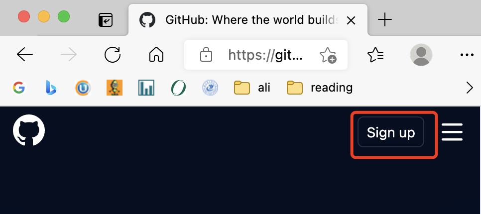


2. 在注册流程中，输入自己的用户名和密码等信息

   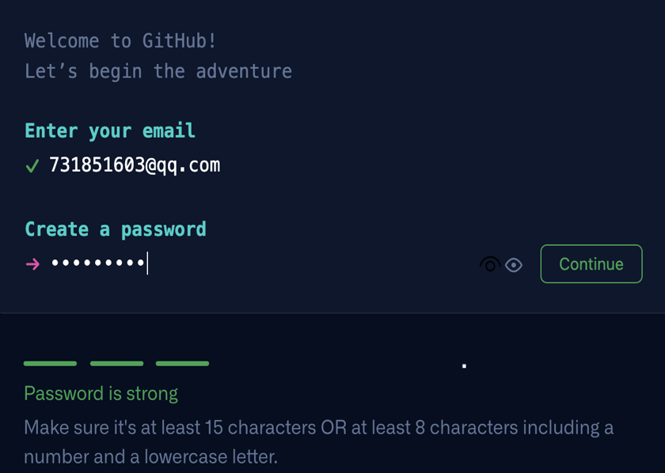

   

   ## 创建private代码仓库

   参考下面两个图片之一，开始创建仓库。

   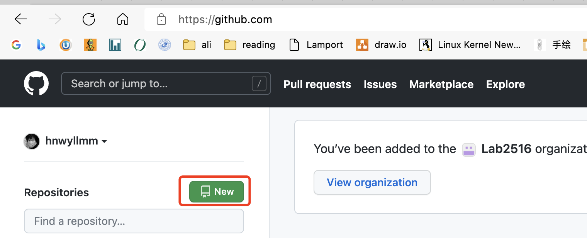

   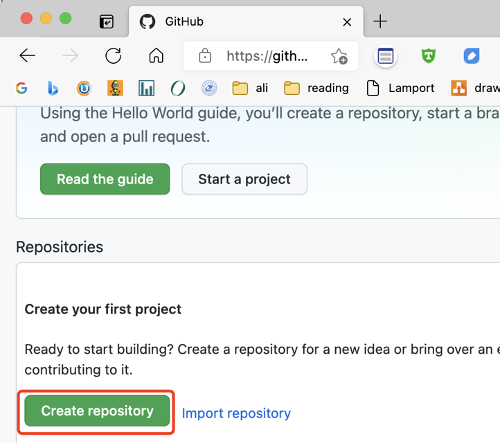

   输入自己的仓库名称

   NOTE：报名oceanbase大赛的同学，仓库名称(Repository name)，不要求一定是miniob，可以起自己喜欢的名字。

   注意，一定要设置为 `private` 模式，否则所有人都能看到你的代码，不能保证代码的安全。
   
   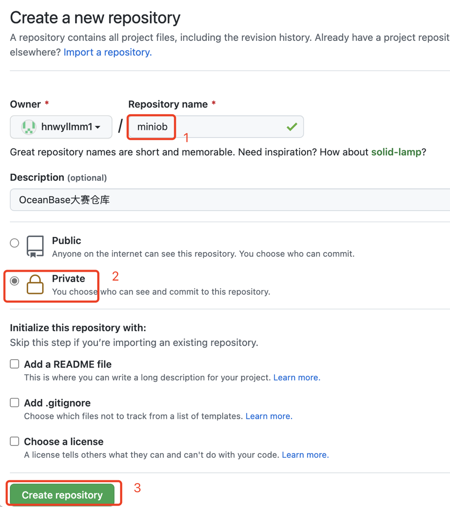

邀请官方测试人员，参与仓库共建

找到仓库设置页，选择`manage access`，进行设置。

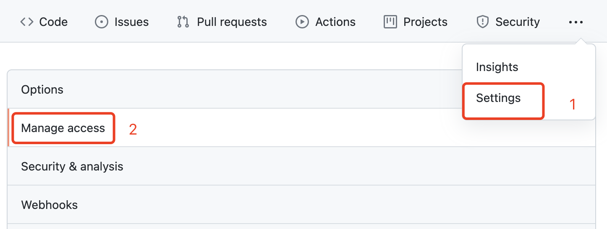

邀请人员共建

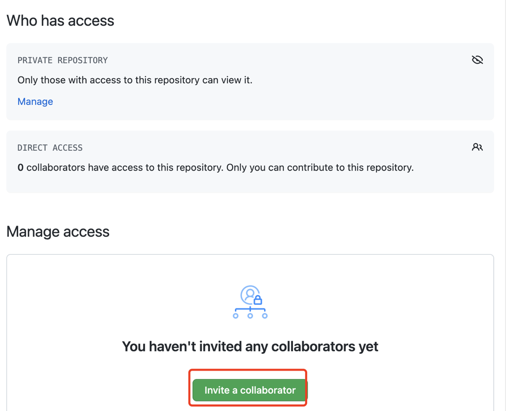


添加官方测试同学

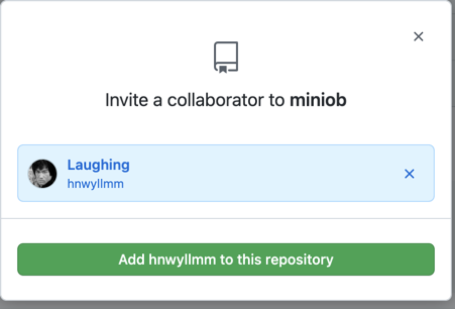


添加后，官方测试同学，会收到邮件邀请链接。请耐心等待，官方同学会定期处理。

## 如何拉取官方仓库代码到自己仓库

官方仓库地址

```
https://github.com/oceanbase/miniob.git
```


执行 

```bash
git clone https://github.com/oceanbase/miniob.git
```

将代码拉到本地。

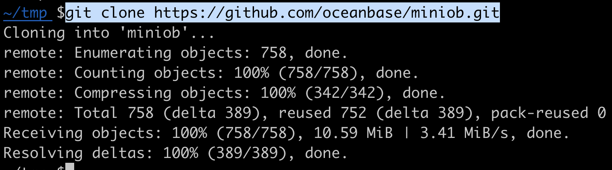

进入到miniob目录，删除 `.git` 目录，清除已有的git信息

```bash
cd miniob
rm -rf .git
```


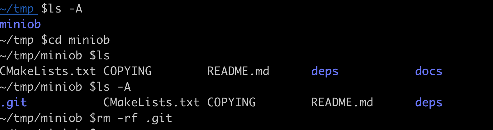

​	重新初始化git信息，并将代码提交到自己的仓库

```bash
git add .
git commit -m 'init'  # 提交所有代码到本地仓库
```

将代码推送到远程仓库

```bash
git remote add origin https://github.com/hnwyllmm1/miniob.git
git branch -M main
git push -u origin main
```

注意替换命令中的信息为自己的信息。

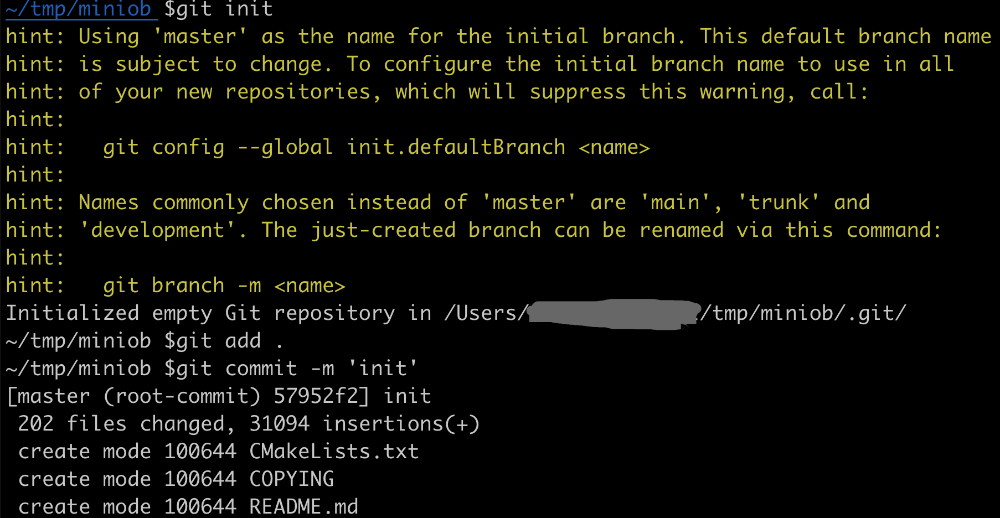

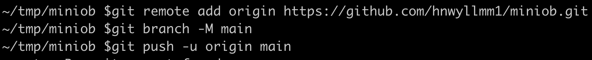

# 日常git开发命令

git与SVN、CSV等都是常用的，团队开发工具，能够记录代码修改历史记录，多人写作。

git已经有很久的历史，人们也摸索出了一套开发流程建议，在多人团队共同开发代码时，遵守这套流程规范，能够减少很多错误。

本次大赛，最多支持3人一组，而且参赛选手交流比较容易，所以这里给出一个简单的开发流程。

## git 分支

我们在git 上开发时，都是在某个分支上进行操作，修改、提交代码。一个分支的代码，修改后不会影响其它分支。除非明确执行合并。

分支的一个好处就是，多个人在开发新功能，或者修改BUG时，都在自己的分支上修改，修改完成，测试正确后，再合并到共同的分支。

分支可以非常容易的创建和销毁。当我们开发一个新功能时，可以基于某一个分支(比如main/master)，创建一个分支 feature/test，在新的分支上修改代码，完成后，合并到main/master分支上。

## 本地仓库 vs. 远程仓库

大家在开发时，首先会从github上clone代码到本地机器，那么这时本地就会有一个仓库。

简单来说，github上面的仓库，是远程仓库，是所有人都能够看到的仓库。

拉到本地后，本地上也会有一个仓库，称为本地仓库(local)。我们在本地上做的任何修改，都不会直接影响到远程仓库，除非我们执行push操作。

## 仓库 & 分支

不管是远程仓库，还是本地仓库，都可以创建分支。也可以关联本地分支到远程分支，这样本地开发完成后，执行push命令，就可以将本地修改同步到远程。


## 开发流程

这里针对OB大赛做一个简单的流程建议。

### 分支

在仓库创建出来的时候，就会有一个默认分支，一般是main或者master。大赛后台测试，每次会拉取默认分支进行编译测试。

因此，建议将main/master 作为“稳定”分支，就是所有的修改，都测试完成后，再merge到main/master。

后续，所有的默认分支都称为`main`。

如果是团队开发，建议创建一个`dev`或`develop`分支（后面使用`develop`，作为团队共同开发的分支，大家修改的新功能，先merge 到develop，在develop测试通过后，再merge 到`main`。

对于团队中的成员，可以开启一个自己的分支，或者以功能名称命名的分支，比如`feature/update`。

### 流程

**对于团队**

1. 创建主分支`main`

2. 创建开发分支`develop`

团队准备提交代码到主分支时，执行：
```bash
# 切换到开发分支
git checkout develop
# 拉取最新代码
git pull
# 执行一系列测试，没有问题的时候
# 切换到主分支，并更新到最新
git checkout main
git pull
# 合并开发分支
git merge develop
# 推送到远程仓库，这时官方测试人员，就可以拉到最新的代码
git push
```

**对于个人**

1. 拉取团队仓库代码(git clone)
2. 切换到`develop`分支(git checkout develop)
3. 创建新分支，用于开发新的功能，比如 `git checkout -b feature/update`
4. 功能开发完成，测试通过后，提交代码到本地仓库 `git add . && git commit -m 'your commit message'`
5. 同步代码到开发分支`develop`
```bash
# 切换到develop分支
git checkout develop 

# 同步远程分支代码
git pull

# 合并 feature/update 到develop
git merge feature/update

# 合并完成后，推送到远程仓库
git push

# 然后删除自己的feature分支
git branch -d feature/update

```


### 常用命令

- 查看当前分支

```bash
git branch  # 查看本地分支

git branch -a # 查看所有分支，包括远程分支
```

- 如何创建分支

```bash
git checkout -b 'your branch name'

git branch -d 'your branch name'  # 删除一个分支
```

- 如何切换分支

```bash
git checkout 'branch name'
```


- 如何提交代码

```bash
# 添加想要提交的文件或文件夹
git add 'the files or directories you want to commit' 
# 这一步也可以用 git add . 添加当前目录

# 提交到本地仓库
# -m 中是提交代码的消息，建议写有意义的信息，方便后面查找
git commit -m 'commit message'

```

- 如何推送代码到远程仓库

```bash
git push
# 可以将多次提交，一次性push到远程仓库
```

- 如何合并代码

```bash
# 假设当前处于分支 develop 下
git merge feature/update
# 会将 feature/update 分支的修改，merge 到 develop 分支
```

- 如何临时修改另一个分支的代码

```bash
# 有时候，正在开发一个新功能时，突然来了一个紧急BUG，这时候需要切换到另一个分支去开发
# 这时可以先把当前的代码提交上去，然后切换分支。或者也可以这样：
git stash # 将当前的修改保存起来

git checkout main # 切换到主分支，或者修复BUG的分支

git checkout -b fix/xxx  # 创建一个新分支，用于修复问题

# 修改完成后，merge到main分支
# 然后，继续我们的功能开发
git checkout feature/update # 假设我们最开始就是在这个分支上
git stash pop

# stash 还有很多好玩的功能，大家可以探索一下
```