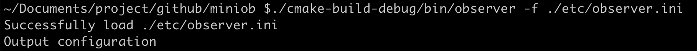
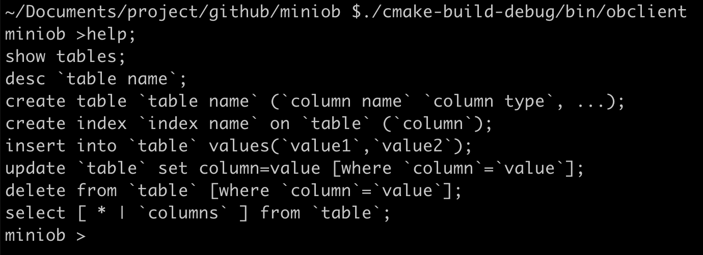

# OceanBase大赛miniob代码架构框架设计和说明

# miniob代码结构说明

## 背景
miniob设计的目标是让不熟悉数据库设计和实现的同学能够快速的了解与深入学习数据库内核，期望通过miniob相关训练之后，能够对各个数据库内核模块的功能与它们之间的关联有所了解，并能够在使用时，设计出高效的SQL。面向的对象主要是在校学生，并且诸多模块做了简化，比如不考虑并发操作。

## miniob结构
miniob作为一个具有“基本”功能的数据库，包含了需要的基本功能模块。包括
● 网络模块：负责与客户端交互，收发客户端请求与应答；
● SQL解析：将用户输入的SQL语句解析成语法树；
● 执行计划缓存：执行计划缓存模块会将该 SQL第一次生成的执行计划缓存在内存中，后续的执行可以反复执行这个计划，避免了重复查询优化的过程（未实现）。
● 语义解析模块：将生成的语法树，转换成数据库内部数据结构（未实现）；
● 查询缓存：将执行的查询结果缓存在内存中，下次查询时，可以直接返回（未实现）；
● 查询优化：根据一定规则和统计数据，调整/重写语法树。当前实现为空，留作实验题目；
● 计划执行：根据语法树描述，执行并生成结果；
● 会话管理：管理用户连接、调整某个连接的参数；
● 元数据管理：记录当前的数据库、表、字段和索引元数据信息；
● 客户端：作为测试工具，接收用户请求，向服务端发起请求。

SQL的执行流程可以参考 [SQL 请求执行流程](https://open.oceanbase.com/docs/community/oceanbase-database/V3.1.0/sql-request-execution-process-1)。

## 模块工作原理介绍
### seda异步事件框架
miniob使用了seda框架，在介绍其它模块之前有必要先了解一下seda。
SEDA全称是：stage event driver architecture，它旨在结合事件驱动和多线程模式两者的优点，从而做到易扩展，解耦合，高并发。
各个stage之间的通信由event来传递，event的处理由stage的线程池异步处理。线程池内部会维护一个事件队列。
在miniob中，从接收请求开始，到SQL解析、查询优化、计划执行都使用event来传递数据，并且可以通过seda来配置线程池的个数。

### 服务端启动过程
虽然代码是模块化的，并且面向对象设计思想如此流行，但是很多同学还是喜欢从main函数看起。那么就先介绍一下服务端的启动流程。
main函数参考 main@src/observer/main.cpp。启动流程大致如下：
解析命令行参数 parse_parameter@src/observer/main.cpp
加载配置文件    Ini::load@deps/common/conf/ini.cpp
初始化日志       init_log@src/observer/init.cpp
初始化seda      init_seda@src/observer/init.cpp
初始化网络服务 init_server@src/observer/main.cpp
启动网络服务    Server::serve@src/net/server.cpp
建议把精力更多的留在核心模块上，以更快的了解数据库的工作。

### 网络模块
网络模块代码参考src/observer/net，主要是Server类。
在这里，采用了libevent作为网络IO工具。libevent的工作原理可以参考libevent官方网站。
网络服务启动时，会监听端口，接受到新的连接，会将新的连接描述字加入到libevent中。在有网络事件到达时（一般期望是新的消息到达），libevent会调用我们注册的回调函数(参考Server::recv@src/observer/net/server.cpp)。当连接接收到新的消息时，我们会创建一个SessionEvent(参考seda中的事件概念），然后交由seda调度。

### SQL解析
SQL解析模块是接收到用户请求，开始正式处理的第一步。它将用户输入的数据转换成内部数据结构，一个语法树。
解析模块的代码在src/observer/sql/parser下，其中lex_sql.l是词法解析代码，yacc_sql.y是语法解析代码，parse_defs.h中包含了语法树中各个数据结构。
对于词法解析和语法解析，原理概念可以参考《编译原理》。
其中词法解析会把输入（这里比如用户输入的SQL语句）解析成成一个个的“词”，称为token。解析的规则由自己定义，比如关键字SELECT，或者使用正则表达式，比如"[A-Za-z_]+[A-Za-z0-9_]*" 表示一个合法的标识符。
对于语法分析，它根据词法分析的结果（一个个token），按照编写的规则，解析成“有意义”的“话”，并根据这些参数生成自己的内部数据结构。比如SELECT * FROM T，可以据此生成一个简单的查询语法树，并且知道查询的columns是“*”，查询的relation是"T"。
NOTE：在查询相关的地方，都是用关键字relation、attribute，而在元数据中，使用table、field与之对应。

### 计划执行
在miniob的实现中，SQL解析之后，就直接跳到了计划执行，中间略去了很多重要的阶段，但是不影响最终结果。
计划执行的代码在src/observer/sql/executor/下，主要参考execute_stage.cpp的实现。

### seda编程注意事项
seda使用异步事件的方式，在线程池中调度。每个事件(event)，再每个阶段完成处理后，都必须调用done接口。比如 
● event->done(); // seda异步调用event的善后处理
● event->done_immediate(); // seda将直接在当前线程做event的删除处理
● event->done_timeout(); // 一般不使用
当前Miniob为了方便和简化，都执行event->done_immediate。
在event完成之后，seda会调用event的回调函数。通过 event->push_callback 放置回调函数，在event完成后，会按照push_callback的反向顺序调用回调函数。
注意，如果执行某条命令后，长时间没有返回结果，通过pstack也无法找到执行那条命令的栈信息，就需要检查下，是否有event没有调用done操作。
当前的几种event流程介绍：
recv@server.cpp接收到用户请求时创建SessionEvent并交给SessionStage
SessionStage处理SessionEvent并创建SQLStageEvent，流转->
ResolveStage 流转 SQLStageEvent ->
QueryCacheStage 流转 SQLStageEvent ->
PlanCacheStage 流转 SQLStageEvent ->
ParseStage 处理 SQLStageEvent  并创建 ExecutionPlanEvent，流转到->
OptimizeStage 流转 ExecutionPlanEvent ->
ExecuteStage 处理 ExecutionPlanEvent 并创建 StorageEvent，流转到->
DefaultStorageStage 处理 StorageEvent

### 元数据管理模块
元数据是指数据库一些核心概念，包括db、table、field、index等，记录它们的信息。比如db，记录db文件所属目录；field，记录字段的类型、长度、偏移量等。

### 客户端
这里的客户端提供了一种测试miniob的方法。从标准输入接收用户输入，将请求发给服务端，并展示返回结果。这里简化了输入的处理，用户输入一行，就认为是一个命令。

### 通信协议
miniob采用TCP通信，纯文本模式，使用'\0'作为每个消息的终结符。
注意：测试程序也使用这种方法，***请不要修改协议，后台测试程序依赖这个协议***。
注意：返回的普通数据结果中不要包含'\0'，也不支持转义处理。

### 参赛建议
在做miniob的题目时，不要做一个题目再看下一个题目，团队中多个同学分别做自己的题目时，也不要一直单独作战，因为完成课题时，需要修改的模块会有非常多的重叠，因此建议团队尽量统筹规划，避免代码冲突以及“越走越难”。

# 参考
《数据库系统实现》
《数据库系统概念》
《flex_bison》  flex/bison手册
[flex开源源码](https://github.com/westes/flex)
[bison首页](https://www.gnu.org/software/bison/)
[cmake官方手册](https://cmake.org/)
[libevent官网](https://libevent.org/)
[SEDA wiki百科](https://en.wikipedia.org/wiki/Staged_event-driven_architecture)
[OceanBase数据库文档](https://www.oceanbase.com/docs)
[OceanBase开源网站](https://github.com/oceanbase/oceanbase)

# 附录-编译安装测试
## 编译环境
miniob使用cmake管理，要求cmake版本至少3.14，编译的C++标准是C++14，所以使用的编译器需要支持C++14。
编译器推荐使用gcc或clang，使用Windows操作系统的同学，建议使用Linux虚拟机或docker编译，程序会最终在Linux操作系统上测试。

## 编译
参考源码中  docs/how_to_build.md 文件。
如文件中描述，miniob依赖下面几个模块，可以参考文件提前安装：
● libevent
● googletest
● jsoncpp

依赖安装完成后，参考how_to_build.md中最后一步，编译miniob。创建build目录，在build目录中执行命令cmake ..，然后执行make -j4，如果编译DEBUG版本，执行cmake -DDEBUG ..，注意，在提交代码前，最好用非DEBUG模式测试一下，因为测试环境中将使用非DEBUG模式。编译结果保存在build目录中，observer/obclient可执行程序会在build/bin目录下生成。
NOTE: make -j4将开启4个并发来编译代码，如果你的机器CPU和内存比较多，可以使用更大的参数。

## 运行服务端
编译完成后，执行 observer -f observer.ini 可以运行服务端程序。
其中-f表示参数observer.ini是配置文件。目前提供了样本配置文件，在源码的etc目录下。
使用-p参数，可以覆盖配置文件中指定的端口号，注意修改代码时不要调整这个参数。
示例：




## 运行客户端

默认直接执行obclient即可。obclient从标准输入中接受输入，每收到一行数据，就向服务端发送请求，并等待应答。

可以通过命令行参数修改客户端连接的服务端信息：

obclient [ip] [port] 




# 附录-SQL解析

## 如何编译词法分析和语法分析模块

词法分析代码lex_sql.l使用下面的命令生成C代码：

flex lex_sql.l

生成 lex.yy.c和lex.yy.h文件。

语法分析代码yacc_sql.y使用下面的命令生成C代码：

bison -d -b yacc_sql yacc_sql.y

将会生成代码yacc_sql.tab.c和yacc_sql.tab.h。

其中-b表示生成的源码文件前缀，-d表示生成一个头文件。

注意：flex 使用 2.5.35 版本测试通过，bison使用**3.7**版本测试通过(请不要使用旧版本，比如macos自带的bision）。

注意：当前没有把lex_sql.l和yacc_sql.y加入CMakefile.txt中，所以修改这两个文件后，需要手动生成c代码，然后再执行编译。

## 如何调试词法分析和语法分析模块

对于lex_sql.l，参考代码中的YYDEBUG宏，可以在lex_sql.l中增加调试代码和开启宏定义，也可以在编译时定义这个宏，比如直接修改lex.yy.c代码，在代码前面增加#define YYDEBUG 1。注意，lex.yy.c是自动生成代码，执行flex命令后，会把之前的修改覆盖掉。示例：

```c++
#include "yacc_sql.tab.h" 
extern int atoi(); 
extern double atof(); 
char * position = ""; 
#define YYDEBUG 1 // 可以在这里定义 YYDEBUG宏 
#ifdef YYDEBUG 
#define debug_printf  printf   // 也可以调整lex_sql.l代码，在定义YYDEBUG宏的时候，做更多事情 
#else 
#define debug_printf(...) 
#endif // YYDEBUG
```

对于yacc_sql.y，可以在yyerror中输出错误信息，或者直接使用调试工具设置断点跟踪。

## 如何手动安装bison
1. 下载一个合适版本的bison源码（下载链接 http://ftp.gnu.org/gnu/bison/），比如[bison-3.7.tar.gz](http://ftp.gnu.org/gnu/bison/bison-3.7.tar.gz)

2. 在本地解压。进入bison-3.7

3. 执行  ./configure --prefix=`your/bison/install/path`

4. 执行 make install

5. 安装完成

  

  注意安装后的Bison在指定的安装目录的bin下，如果不调整PATH环境变量，无法直接使用到最新编译的bison二进制文件，需要写全路径使用，比如 your/bison/install/path/bin/bison。

# **附录-输出约束**

*** 注意： 后台测试环境，依赖本章节的输出要求。如果输出格式不满足要求，有些case将无法通过***

输出是指服务端返回给客户端的数据。为了可以做测试，需要对输出的格式做约束。
NOTE：后台测试程序，是将预先编辑好的Case执行后，将执行结果与预期输出结果（预先编写完成）做对比，与mysql test工作原理类似，因此需要严格按照输出约束来输出。

1. 语法解析错误，返回 FAILURE。
2. 对于DML和DDL操作，执行成功返回SUCCESS，失败返回FAILURE。更新和删除操作时没有数据变更，只要没有错误，输出也是SUCCESS。
3. 对于QUERY操作，如果执行失败，返回FAILURE（包括语法错误）。否则按照下面的格式要求输出：列名显示和顺序说明：
● 单表查询，没有指定列名(select * from t) ，按照建表语句的顺序列出列名，列名不需要带表明
● 单表查询，指定了列名，按照指定的顺序输出列名，列名不需要带表名
● 表查询，没有指定列名(select * from t,t1)，列名需要带表明，使用‘.'分开。每张表的列名与建表时顺序保持一致，多张表按照from后指定的顺序依次排列
● 多表查询，指定列名，就按照指定的顺序排列
● 多表查询，有些指定列名，有些没有指定(select t1.*, t2.id from t1,t2)。没有指定的与建表时保持一致，否则按照指定的顺序排列
输出格式：
列名之间使用 ' | '分开，注意 '|'左右各有一个空格。输出列名后，第二行开始输出列值，值之间也使用' | '隔开。
注意：第一列和最后一列没有分隔符，也没有空格
如果没有数据，显示列名即可
● 聚合函数字段输出，保留与输入相似的格式。比如select max(age) from t; 那么输出时，列名输出max(age)。注意，圆括号内没有空格。

4. 所有输出不区分大小写
5. 日期(date)输入格式使用："YYYY-mm-DD"
6. 输出的字符串不使用单引号双引号或其它括起来
7. 浮点数输出，不要带后面多余的0，可以参考C sprintf的%g格式输出，保留两位小数。

# 附录-参赛代码提交
选手以团队级别提交代码。每个团队在github.com上建立自己的private权限仓库，给团队成员设置需要的权限，并且需要给OceanBase大赛官方人员(github账号 hnwyllmm) 设置可读权限（邀请hnwyllmm加入共同开发仓库即可），后台测试程序会定时从仓库上拉取代码并测试。
每天10:00和16:00(时间并不完全精确，只是大概时间) 测试程序会拉取代码并测试，完成后会更新排名信息。
如果检测出代码与别人有重复，结果会判为无效。

# 附录-测试环境说明
操作系统：Linux version 4.19.91-23.al7.x86_64
编译器：gcc-8.3.0 （使用clang的同学注意，编译结果可能与gcc稍有不同)
cmake: 3.20.52
make: GNU Make 3.82

# FAQ
客户端输入的字符串字段只保留了4个字节
最基础的miniob代码，仅支持3中类型的字段，分别是int、float和char，其中char是字符串类型，仅有4个字节长度。如果是处理日期类型，可以选择保存为整数，或者扩展char，以支持更长的字符串。